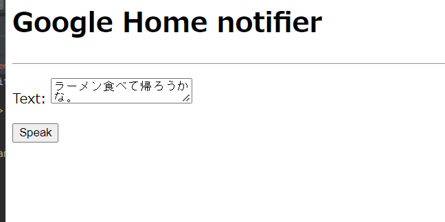

# Google Homeをしゃべらせたい
## Google Homeとおしゃべりするための調査

- [RaspberryPi＋GoogleHome+Webカメラで顔認識でお出迎えしてくれるGoogleHomeを構築する](https://qiita.com/sey323/items/65c41264bd1ca9b765a0)
- [Pythonを使って、Google Homeに喋らせてみる](https://qiita.com/attakei/items/c5de47f3c1f53992c353)
- [Python 3 から Google Home に喋らせる（低遅延）](https://qiita.com/rukihena/items/8af9b8baed49542c033d)
- [Webサーバ不要！PythonでGoogle Home（Nest）に任意のテキストをしゃべらせてみる](https://makitat.com/wp-1/2020/google_home_speak_by_python/)

## google-home-notifier
node.js製の、Google Homeに対してテキストを喋らせるライブラリです。

1. mDNSでLAN内のGoogle Homeを探す
1. テキストをGoogle Text-to-Speechを使ってmp3のURLを作成する
1. (2)のURLをGoogle Homeに渡して再生させる

## pychromecast

Chromecastとの通信をしてくれるライブラリ.
>Check out Home Assistant for a ready-made solution using PyChromecast for controlling and automating your Chromecast or Cast-enabled device like Google Home.

とREADMEにあるとおり、Google HomeはGoogleCast仕様に基づくらしく、このライブラリでそのまま拾うことができます。

## Google Home のIPを調べる方法
どうやら同じWifiネットワーク上にないらしい。 これを調べる。
再設定したほうが早そう。

PCが5GHz、GoogleHomeが2.4GHzに繋がっていたので、一旦PCを2.4GHzに設定して試してみる。

## pychromecast

いろんなQiita記事があったが、最新情報が記載されているGitHubが一番参考になった。
https://github.com/home-assistant-libs/pychromecast

```python
import pychromecast

# 名前が"リビングルーム"のデバイスを探す
chromecasts, browser = pychromecast.get_listed_chromecasts(friendly_names=["リビングルーム"])
print(chromecasts)
[Chromecast(
    'unknown',
    port=8009,
    cast_info=CastInfo(
        services={ServiceInfo(
            type='mdns', 
            data='Google-Home-Mini-dc71715368bcd63109d484ff41344a3e._googlecast._tcp.local.')
            }, 
        uuid=UUID('dc717153-68bc-d631-09d4-84ff41344a3e'), 
        model_name='Google Home Mini', 
        friendly_name='リビングルーム', 
        host='192.168.11.3', 
        port=8009, 
        cast_type='audio', 
        manufacturer='Google Inc.')
    )
]
```

検索したChromeCastをcastとして、自分の名前を出力する
```python
cast = chromecasts[0]
# Start worker thread and wait for cast device to be ready
cast.wait()
print(cast.name)

'リビングルーム'
```

状態を表示する
```python
print(cast.status)
CastStatus(
    is_active_input=None, 
    is_stand_by=None, 
    volume_level=0.30000001192092896, 
    volume_muted=False, 
    app_id=None, 
    display_name=None, 
    namespaces=[], 
    session_id=None, 
    transport_id=None, 
    status_text='', 
    icon_url=None, 
    volume_control_type='master')
```

## 音を鳴らしてみる

適当なサンプルのmp3鳴らしてみる。

```python
mc = cast.media_controller
cast.wait()
mc.play_media('https://samplelib.com/lib/preview/mp3/sample-3s.mp3','audio/mp3')
print(mc.status)
```

## gTTSで任意の言葉の音声を作成
Google Text-to-speech。テキストをmp3に変換してくれる。

```
from gtts import gTTS
tts = gTTS(text='ハローワールド', lang='ja')
tts.save('./hello_world_ja.mp3')
```

「ハローワールド」と日本語でしゃべった。

## Python初心者向けBottleの使い方

Bottleを使ってみる。Flaskみたいなモノらしい。 

こちらの記事を参照：https://blog.codecamp.jp/programming-python-bottle
Python製の Webフレームワークで、 「Python で Webサイト」、 「Python で Webアプリ」 といえば最初に登場するもの。

ということで、コーディング。
[Pythonを使って、Google Homeに喋らせてみる](https://qiita.com/attakei/items/c5de47f3c1f53992c353)
をリスペクトして、必要な部分のみ変更。

```python
# -*- coding: utf-8 -*-
import os
from pathlib import Path
from bottle import Bottle, request, template, static_file
from gtts import gTTS
import pychromecast

BASE_DIR = Path(__file__).parent
TALK_DIR = BASE_DIR / 'var'
app = Bottle()

@app.route('/talks/<file_path:path>')
def post_talk(file_path):
    return static_file(file_path, root=TALK_DIR)

@app.route("/")
def hello():
    return "Hello World"
    # [/index]へアクセスがあった場合に「html.index」を返す

@app.route('/form', method='GET')
def get_talk_form():
    content = BASE_DIR / 'template.html'
    text = request.forms.text or ''
    lang = request.forms.lang or 'ja'
    return template(content.open().read(), lang=lang, text=text)


@app.route('/form', method='POST')
def post_talk_form():
    text = request.forms.text
    lang = 'ja'
    text_token = generate_talk(text, lang)
    url = f"http://{app.host}:{app.port}/talks/{text_token}"
    # 名前が"リビングルーム"のデバイスを探す
    chromecasts, browser = pychromecast.get_listed_chromecasts(friendly_names=["リビングルーム"])
    cast = chromecasts[0]
    mc = cast.media_controller
    print(url)
    cast.wait()
    mc.play_media(url, 'audio/mp3')
    return get_talk_form()

def generate_talk(text_form, lang='ja'):
    # text_token = hashlib.sha256((lang + text).encode()).hexdigest()
    text_token = 'test.mp3'
    talk_path = TALK_DIR / text_token
    print(text_form + ',' + lang)
    tts = gTTS(text=str(text_form), lang=lang)
    # tts = gTTS(text='こんにちは', lang='ja')
    tts.save(talk_path)
    return text_token

if __name__ == '__main__':
    if not TALK_DIR.exists():
        TALK_DIR.mkdir()
    app.host = os.environ.get('SERVER_HOST', '192.168.11.7')
    app.port = os.environ.get('SERVER_PORT', '8080')
    app.run(host=app.host, port=app.port, reloader=True)
```

```html
<h1>Google Home notifier</h1>
<hr />
<form method="POST">
    <p>
        Text:
        <textarea name="text">{{text}}</textarea>
    </p>
    <p>
        <button>Speak</button>
    </p>
</form>
```




しゃべった！

## このあとやりたいことメモ

- 誰か帰ってきたらしゃべる
- センサと連動してしゃべる
- リマインド・通知機能として使ってみる
- 妻に日頃の感謝を伝える

どんな使い方が便利かあまりイメージがつかなくなってきた…。
